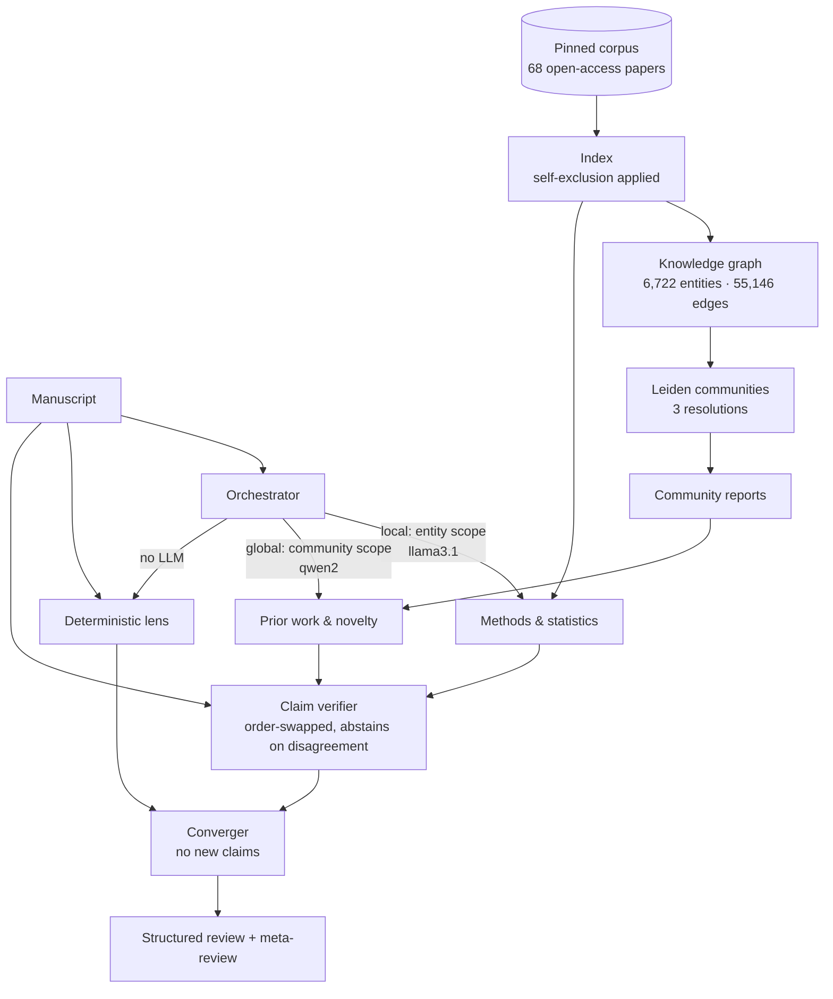

# PeerPanel

**A multi-agent scientific-review system with GraphRAG retrieval, measured against its own
baselines — including where it loses.**

Independent reviewer agents with structurally different lenses read a manuscript against a pinned
open-access corpus, an adversarial verifier checks every claim against retrieved evidence, a
deterministic non-LLM lens catches what language models miss, and a converger writes the
meta-review over the structured record. Everything runs locally on small open models at zero cost.



## Try it in 60 seconds, with no model and no setup

```bash
git clone https://github.com/javrodriguez/peerpanel && cd peerpanel
uv sync --dev
make quickstart     # ~4s: rebuilds the graph, detects communities, runs retrieval
make test           # ~20s: the full deterministic suite
make ablation       # ~3s: the retrieval ladder, from committed bytes
```

None of those touch a model or the network. They rebuild the knowledge graph from committed
extraction records, run Leiden, and execute real retrieval — because every expensive artifact this
project produced is committed, not just described.

The second tier needs [Ollama](https://ollama.com) with `llama3.1:8b`, `qwen2:7b` and
`nomic-embed-text`:

```bash
make corpus         # fetch the 68-document demo corpus (license-gated, md5-verified)
make demo-index     # rebuild the index for real (~6.4h on an M-series laptop)
make review         # run the panel on a real manuscript
make eval           # planted errors: panel vs equal-compute single agent
```

## What the measurements say

Full tables and the honest reading: **[results/RESULTS.md](results/RESULTS.md)**. The headline,
over 68 documents and two query manuscripts with 36 relevant documents between them:

| rung | found @10 | found @30 | recall@10 (of 0.679 ceiling) | NDCG@10 | latency |
|---|---|---|---|---|---|
| BM25 | **13 / 36** | 18 / 36 | 54% | **0.770** | 36 ms |
| vector | **13 / 36** | 17 / 36 | 54% | **0.770** | — |
| RRF hybrid | **13 / 36** | 17 / 36 | 54% | **0.770** | 28 ms |
| GraphRAG local | 12 / 36 | 18 / 36 | **58%** | 0.713 | 507 ms |
| GraphRAG global | 10 / 36 | 10 / 36 | 46% | 0.586 | 7 ms |

**BM25 puts the most relevant documents in the top 10, ranks them best, and does it in 36 ms
against GraphRAG local's 507 ms.** The graph only draws level three times deeper in the list (18
each at @30) — entity-neighbourhood retrieval reaches documents lexical matching misses, then ranks
them too low to help. GraphRAG global is the worst rung on every aggregate measure.

**But n = 2, and the two manuscripts disagree:** GraphRAG local is the best rung on one (recall
0.500 vs 0.375) and second-worst on the other (0.286 vs 0.357). Every number above is a mean over
that reversal, so these results establish *behaviour*, not a ranking — the per-case table is in
[results/RESULTS.md](results/RESULTS.md) and the raw JSON beside it. They are published rather than
omitted because a retrieval layer that cannot clearly beat BM25 on a corpus like this has not earned
its complexity.

Recall is always shown against its achievable ceiling: with 28 relevant documents, no top-10 list
can exceed 0.357 recall, so a bare number would misrepresent a good result as a poor one.

### The headline measurement, and it is a loss

Three errors planted into a held-out manuscript, inside the window both systems read:

| system | detected | tokens | wall |
|---|---|---|---|
| panel (2 reviewers + verifier + lens + converger) | **1 / 3** | 165,334 | 2,751 s |
| single agent, CoT + self-consistency | **3 / 3** | 36,857 | 344 s |

**A single well-prompted agent found every planted error. The panel found one, for 4.5× the tokens
and 8× the wall-clock.** This is the row the multi-agent literature says is always missing —
architectures that "often fail to outperform simple single-agent baselines… even when consuming
significantly more inference-time computation"
([arXiv:2502.08788](https://arxiv.org/abs/2502.08788)) — reproduced against the system this repo
exists to demonstrate.

The comparison has a real confound, disclosed rather than used as an excuse: the baseline was asked
to hunt errors, the panel was asked to review. A fairer test gives both the same instruction. But a
review panel that misses a swapped gene symbol is a finding either way, and the baseline won with a
fifth of the compute. The full reading, including what the panel measurably *is* good at, is in
[results/RESULTS.md](results/RESULTS.md).

And from two independent panel runs on a real manuscript — **swap-consistency 0.42 and 0.50, n = 24
each**. Between five and six verdicts in ten flipped when the evidence order was reversed, and were
forced to abstain. Position bias is not a hypothetical this system guards against; it is the largest
measured effect in it — and the gap between the two runs is why the figure is given as a range.
The same run also produced one hallucinated finding in sixteen, where a reviewer attributed
retrieved literature to the manuscript. Both numbers are in
[results/RESULTS.md](results/RESULTS.md), with the reasoning.

## How it is built

**GraphRAG, from scratch.** Chunk → LLM entity/relation extraction → merged knowledge graph →
multi-level Leiden communities → LLM community reports → local (entity-anchored) *and* global
(community-anchored) search. This is an independent implementation of the architecture class
Microsoft's GraphRAG describes; it is not affiliated with that project and does not use its code
(which cannot install on Python 3.14 — see [DECISIONS.md](DECISIONS.md) D2).

**Reviewers differ structurally, not by persona.** The methods reviewer searches entity
neighbourhoods; the novelty reviewer searches community summaries; they run on different model
families and never see each other's output. Prompt-level "you are a rigorous reviewer" personas
[measurably do not improve performance](https://arxiv.org/abs/2311.10054), so the differentiation
is in retrieval scope, rubric and model — things that can be inspected.

**Position bias is mitigated and measured.** Every claim is judged twice with the evidence order
reversed. Agreement stands; disagreement forces `NOT_ENOUGH_INFO`. The swap-consistency rate ships
with its n, and is withheld when n is too small to mean anything.

**Evidence grounding is enforced in code.** A verdict's evidence survives only if the chunk was
actually retrieved *and* the quote is a substring of that chunk. Fabricated citations cannot pass
the type system, let alone the reviewer.

**A manuscript can never retrieve itself.** Several of these papers exist in the corpus in
published form. When one is reviewed, its twin's chunks leave the index and the knowledge graph is
*rebuilt* with that document's extractions withheld — removing not just its entities but the edge
weight it contributed between surviving ones. The mechanism is defended by tests that drive the
real orchestration and fail when it is disabled.

## What is real, and what is recorded

Nothing here is mocked. The distinction that matters:

- **Runs for real, everywhere, every time:** chunking, sanitation, graph construction, Leiden,
  every retrieval rung, the eval harness, the deterministic lens.
- **Recorded from real runs and committed:** per-chunk extractions, community reports, embeddings.
  These are actual `llama3.1:8b` and `nomic-embed-text` outputs, cached by content hash, each with
  the command that regenerates it. CI replays them — it has no GPU — and any drift fails loudly.
- **Proven by captured runs:** the index builds and a full panel review, whose raw logs and
  structured records are committed under `results/` alongside the measurements they produced.

The one adapter that has never run — Anthropic's — says so in its own docstring and is tested for
request shape only. No API key exists on the development machine and none was requested.

## Read this next

- **[results/RESULTS.md](results/RESULTS.md)** — every measurement, with its honest reading.
- **[LIMITATIONS.md](LIMITATIONS.md)** — what this does not do, what the numbers do not prove, and
  eight known failure modes of LLM review with what is done about each — three of them admitting
  the mitigation is partial or absent.
- **[DECISIONS.md](DECISIONS.md)** — the design calls and the measurements behind them.

## Scope

A pre-submission self-check on already-public manuscripts, by their authors. **Not a substitute
for peer review**, and not for manuscripts under confidential review — publishers and funders
prohibit uploading those to language models.

## License

MIT for the code. Corpus and manuscript documents keep their own Creative Commons licenses, held
by their authors and recorded per-document in [CITATIONS.md](CITATIONS.md).
